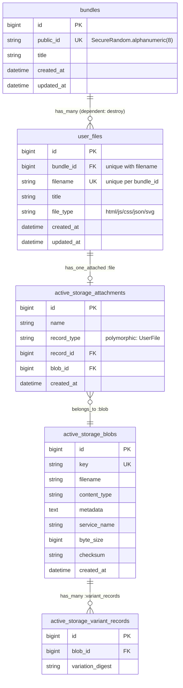

# バックエンド構成

Rails 8.1 (API + フロント配信の単一アプリ)。DB は PostgreSQL、ファイル本体は Active Storage (Disk service) で保存する。認証は独自実装ではなく、Cloud IAP が付与するヘッダーに委譲している。フロントエンドの統合方法 (Vite との連携) は [frontend-architecture.md](./frontend-architecture.md) を参照。

## 概要

このアプリ (HTML Vault) は、ユーザーがアップロードした静的ファイル (HTML/JS/CSS/JSON/SVG) を保存し、直リンクでブラウザ上にプレビュー表示できるようにするツール。管理画面 (アップロード/一覧/削除) は React SPA (`frontend/`) が担い、Rails はその API と、アップロード済みファイルの配信を担う。

アップロードは常に `Bundle` (複数ファイルの「セット」) 単位で行う。1 ファイルだけの単体アップロードも「要素数 1 の `Bundle`」として扱われ、特別扱いはしない。バンドル配下のファイルは共通の URL 名前空間 (`/preview/:bundle_public_id/:filename`) で配信されるため、`index.html` + `style.css` + `app.js` のような複数ファイルをまとめてアップロードした場合、HTML 内の相対パス参照 (`<link href="style.css">` 等) がプレビュー時に正しく解決される。

## ディレクトリ構成

```
app/
  controllers/
    application_controller.rb       # 全コントローラーの基底。IAP認証ヘルパーを持つ
    admin_controller.rb              # 管理画面 (SPA) の entry HTML を返す
    preview_controller.rb           # /preview/:bundle_public_id/*filename でファイルを配信
    api/v1/
      base_controller.rb            # API共通の基底 (CSRF検証スキップ, 404ハンドリング)
      bundles_controller.rb         # バンドル (アップロードの単位。1ファイルの単体アップロードも含む) の index/create/destroy
  models/
    user_file.rb                    # Bundle 配下の1ファイル分のメタデータ + Active Storage 添付
    bundle.rb                       # アップロードの単位。1つ以上の UserFile を持つ
  helpers/
    application_helper.rb           # Vite 連携ヘルパー (frontend-architecture.md 参照)
  views/
    admin/index.html.erb            # SPA entry HTML (<div id="root">)
config/
  routes.rb
  database.yml                      # PostgreSQL 接続設定
  storage.yml                       # Active Storage サービス定義 (Disk)
  initializers/content_security_policy.rb  # 未設定 (コメントアウトのみ)
db/
  migrate/                          # active_storage テーブル + user_files/bundles テーブル
  schema.rb
```

## ルーティング (`config/routes.rb`)

| パス | メソッド | 遷移先 | 用途 |
|---|---|---|---|
| `/up` | GET | `rails/health#show` | ヘルスチェック (ロードバランサ等) |
| `/api/v1/bundles` | GET/POST | `Api::V1::BundlesController#index` / `#create` | 一覧取得 / アップロード (1ファイルでも複数ファイルでも同じエンドポイント) |
| `/api/v1/bundles/:id` | DELETE | `Api::V1::BundlesController#destroy` | 削除 (配下のファイルもカスケード削除) |
| `/preview/:bundle_public_id/*filename` | GET | `PreviewController#bundle_show` | アップロード済みファイルの直リンク配信 (バンドル内の相対パス参照解決用の名前空間) |
| `/` | GET | `AdminController#index` | React SPA (管理画面) の entry HTML を返す |

`/preview/:bundle_public_id/*filename` はグロブセグメント (`*filename`) を使っており、`format: false` を明示している点に注意。指定しないと `style.css` のようなリクエストの末尾 `.css` が Rails によって `params[:format]` として切り出されてしまい、`filename` が `style` に化けてルックアップに失敗する。

## コントローラー層

### `ApplicationController`

全コントローラーの基底。`allow_browser versions: :modern` でレガシーブラウザを弾く。

認証は自前実装ではなく **Cloud IAP (Identity-Aware Proxy)** に委譲している。

```ruby
IAP_EMAIL_HEADER = "X-Goog-Authenticated-User-Email"

def current_user_email
  raw_header = request.headers[IAP_EMAIL_HEADER]
  if raw_header.present?
    raw_header.split(":").last          # "accounts.google.com:user@example.com" → "user@example.com"
  elsif Rails.env.development? || Rails.env.test?
    DEV_DUMMY_EMAIL                     # "dev@example.com"
  end
end
```

- 本番では IAP がリバースプロキシとして手前に立ち、検証済みの ID を `X-Goog-Authenticated-User-Email` ヘッダーで転送してくる想定。Rails 側でパスワードやセッションを扱わない。
- 開発/テスト環境には IAP がいないため、ヘッダーが無い場合は固定のダミーメールにフォールバックする。IAP を模した挙動を検証したい場合は `-H "X-Goog-Authenticated-User-Email: accounts.google.com:me@example.com"` を手動で付与する。
- **注意**: `current_user_email` は現状どのコントローラーからも実際には呼ばれていない (未使用)。認可 (誰のファイルか) はまだ実装されておらず、`UserFile` にもユーザーとの紐付けカラムが無いため、ログイン中の全ユーザーがファイル一覧を共有する状態になっている。

### `Api::V1::BaseController`

API 系コントローラー共通の基底。

- `skip_before_action :verify_authenticity_token` — API はブラウザの `fetch` から JSON/multipart で叩かれる想定で、Rails 標準の CSRF トークン検証 (フォーム由来) は行わない。IAP がフロントに立つ構成のため、認証はネットワーク層 (IAP) 側に委ねている前提。
- `ActiveRecord::RecordNotFound` を rescue し、`{ error: "not found" }` を 404 で返す共通ハンドリング。

### `Api::V1::BundlesController`

`/api/v1/bundles` — アップロードの唯一のエンドポイント。1 ファイルの単体アップロードも複数ファイルのセットも区別せず、同じ `create` アクションで受け付ける。

| アクション | 処理内容 |
|---|---|
| `index` | `Bundle.includes(:user_files).order(created_at: :desc)` を取得し、各バンドルを配下ファイル込みで JSON 化 |
| `create` | `params[:files]` (multipart アップロードの配列。1 件でも複数件でも同じ) を受け取り、`Bundle` と配下の `UserFile` 群をトランザクション内で作成。件数が `Bundle::MAX_FILES` (20) を超える場合は書き込み前に `422` で拒否。配下のいずれかのファイルがバリデーションに失敗した場合は `ActiveRecord::Rollback` で全体を巻き戻し `422` を返す (一部だけ作成される状態にはならない) |
| `destroy` | `@bundle.destroy` — `Bundle has_many :user_files, dependent: :destroy` により配下の `UserFile` も連鎖削除され、各 `UserFile` の `before_destroy` で添付ファイルもパージされる |

`serialize` の返却形 (`preview_url` は配下の最初の HTML ファイル、無ければ先頭ファイルを指す):

```json
{
  "id": 1,
  "public_id": "Don9HV0w",
  "title": "Bundle Test",
  "created_at": "2026-08-11T02:13:26+09:00",
  "preview_url": "/preview/Don9HV0w/index.html",
  "files": [
    { "id": 3, "filename": "index.html", "title": "index", "file_type": "html", "created_at": "...", "preview_url": "/preview/Don9HV0w/index.html" },
    { "id": 4, "filename": "style.css", "title": "style", "file_type": "css", "created_at": "...", "preview_url": "/preview/Don9HV0w/style.css" }
  ]
}
```

### `PreviewController`

`/preview/:bundle_public_id/*filename` を配信する、認証不要 (誰でもリンクを知っていれば開ける) のエンドポイント。全アップロードが `Bundle` 単位なので、ファイル配信ルートもこの 1 つだけ。

```ruby
def bundle_show
  bundle = Bundle.find_by!(public_id: params[:bundle_public_id])
  deliver(bundle.user_files.find_by!(filename: params[:filename]))
end

private

def deliver(user_file)
  response.set_header("Content-Security-Policy", "sandbox allow-scripts allow-forms allow-modals;")
  response.set_header("X-Content-Type-Options", "nosniff")
  send_data user_file.file.download, type: user_file.content_type, filename: user_file.filename, disposition: "inline"
end
```

- ユーザーがアップロードした **信頼できない HTML/JS** をそのまま配信するため、`sandbox` ディレクティブ付き CSP でこのレスポンスを親アプリから隔離している。`allow-same-origin` を **含めていない** のがポイントで、これによりサンドボックス化されたドキュメントはこのアプリの Cookie/セッション/localStorage を一切読めない (別オリジン扱いになる)。
- `allow-scripts` / `allow-forms` / `allow-modals` は許可しているため、アップロードされた HTML 内の JS 実行やフォーム操作、`alert()` 等は動作する。
- `X-Content-Type-Options: nosniff` で、ブラウザによる MIME タイプの推測 (スニッフィング) を防止。
- `rescue_from ActiveRecord::RecordNotFound do head :not_found end` を登録している (`Api::V1::BaseController` を継承していないため、API 側の共通ハンドリングとは別にこのコントローラー内で定義)。
- `content_type` は `UserFile#content_type` で拡張子から決定 (下記モデル参照)。
- `skip_forgery_protection` を指定している。Rails は標準で「クロスオリジンの GET リクエストに対する JavaScript レスポンス」を CSRF 対策の一環としてブロックする (`<script src>` によるレガシーな JSONP 型情報漏洩を防ぐ仕組み)。しかしこのアクションはまさに `<script src="app.js">` のようなクロスオリジン埋め込みを意図的に許可する必要がある公開エンドポイントであり、Cookie/セッションを使った認証も行わないため、このチェックは無効化している。無効化しないと、`.js` ファイルのプレビューが `422 Unprocessable Content` になる。

### `AdminController`

`layout false` で `app/views/admin/index.html.erb` をそのまま返すだけの薄いコントローラー。ここが React SPA (管理画面) の entry point になる。詳細は [frontend-architecture.md](./frontend-architecture.md) を参照。

## モデル: `UserFile`

```ruby
class UserFile < ApplicationRecord
  ALLOWED_EXTENSIONS = %w[html js css json svg].freeze
  MAX_FILE_SIZE = 10.megabytes

  belongs_to :bundle
  has_one_attached :file
  before_destroy :purge_file
  ...
end
```

`UserFile` は常にどこかの `Bundle` に属する (`belongs_to :bundle` は必須関連)。単体ファイルのアップロードも「要素数 1 の `Bundle`」として扱われるため、`UserFile` 単独で外部公開用の ID を持つ必要が無く、`public_id` カラムは存在しない (バンドル側の `public_id` + `filename` の組でルックアップする)。

| カラム | 型 | 説明 |
|---|---|---|
| `bundle_id` | bigint, NOT NULL, FK | 所属する `Bundle`。`(bundle_id, filename)` にユニークインデックス (同一バンドル内でのファイル名重複を防止) |
| `filename` | string | アップロード時の元ファイル名。`/preview/:bundle_public_id/:filename` のルックアップキーとしても使われる |
| `title` | string | 表示用タイトル。未指定時は拡張子を除いたファイル名がデフォルト (コントローラー側で設定) |
| `file_type` | string | 拡張子 (`html`/`js`/`css`/`json`/`svg` のいずれか) |
| `file` (Active Storage) | — | ファイル本体。`has_one_attached :file` |

バリデーション:
- `filename` / `title` / `file_type` の presence
- `filename` の uniqueness は `bundle_id` スコープ (常に non-null なので無条件)
- `filename_has_no_path_separators`: `filename` に `/` や `\` を含まないこと (ルーティングのキーとして使われるため)
- `file_type` は `ALLOWED_EXTENSIONS` に含まれること
- `file_attached`: `file.attached?` であること
- `file_extension_allowed`: 添付ファイルの拡張子 (`file.filename.extension_without_delimiter`) が許可リストに含まれること — `file_type` パラメータとは独立に、実ファイルの拡張子でも二重にチェックしている
- `file_size_within_limit`: `MAX_FILE_SIZE` (10MB) 以下であること

`content_type` はプレビュー配信時の `Content-Type` ヘッダーを `file_type` から決定するメソッド (例: `html` → `text/html; charset=utf-8`)。Active Storage が推測する content type ではなく、こちらの固定マッピングを優先して使っている。

`before_destroy :purge_file` で、レコード削除時に Active Storage の添付を明示的にパージする (自動パージされないため)。`UserFile` の直接削除・`Bundle` の `dependent: :destroy` によるカスケード削除のどちらでも、この 1 箇所で確実に実体ファイルが削除される。

## モデル: `Bundle`

```ruby
class Bundle < ApplicationRecord
  MAX_FILES = 20

  has_many :user_files, dependent: :destroy

  before_validation :assign_public_id, on: :create

  validates :public_id, presence: true, uniqueness: true
  validates :title, presence: true
end
```

アップロードの単位となるモデル。`public_id` は `SecureRandom.alphanumeric(8)` で生成し (DB に重複が無いことを確認しながら採番)、内部の連番 `id` を外部 URL に晒さないための仕組み。バンドル配下のファイルを配信する `/preview/:bundle_public_id/*filename` ルートで使われる。`MAX_FILES` (20) は `Api::V1::BundlesController#create` で、書き込み前にアップロード件数の上限チェックに使われる (無制限のファイル数を 1 トランザクションで作成できてしまうのを防ぐ防御的な上限)。

## データベース

PostgreSQL。主なテーブルは 3 系統:

- **Active Storage 標準テーブル** (`active_storage_blobs` / `active_storage_attachments` / `active_storage_variant_records`) — Rails の Active Storage エンジン提供のマイグレーションそのまま
- **`user_files`** — アプリ固有のテーブル。`public_id` にユニークインデックス
- **`bundles`** — 複数の `user_files` をまとめる「セット」。`public_id` にユニークインデックス

### ER図



`user_files.bundle_id` がアプリ内モデル間で唯一の外部キー (`bundles` 1 に対し `user_files` 多)。`user_files` から Active Storage への紐付けは `has_one_attached :file` によるポリモーフィック関連 (`active_storage_attachments.record_type = "UserFile"`) で、`bundles`/`user_files` に外部キーとしてのユーザーカラムは存在しない (既知の制約を参照)。

```ruby
create_table "bundles" do |t|
  t.string "public_id", null: false
  t.string "title", null: false
  t.timestamps
end
add_index :bundles, :public_id, unique: true

create_table "user_files" do |t|
  t.bigint "bundle_id", null: false
  t.string "filename", null: false
  t.string "title", null: false
  t.string "file_type", null: false
  t.timestamps
end
add_index :user_files, [:bundle_id, :filename], unique: true
add_foreign_key :user_files, :bundles
```

`user_files`/`bundles` にユーザーを表す外部キーは無い (現状は全ユーザー共有)。`user_files.bundle_id` がこのアプリで最初の (そして現状唯一の) アプリ内モデル間外部キー。`user_files` に `public_id` カラムは無い (`Bundle` の項を参照)。

### 接続設定 (`config/database.yml`)

- development: `app_development` / test: `app_test` / production: `app_production`
- production は `username: app`、パスワードは `APP_DATABASE_PASSWORD` 環境変数から
- `max_connections` は `RAILS_MAX_THREADS` 環境変数 (デフォルト 5) に連動

## ファイルストレージ (Active Storage)

`config/storage.yml` は `Disk` サービスのみ定義済み (S3/GCS はコメントアウトされたテンプレートのまま、未設定)。

| 環境 | サービス | 保存先 |
|---|---|---|
| test | Disk | `tmp/storage` |
| development / production | Disk (`local`) | `storage/` (development.rb, production.rb 双方で `config.active_storage.service = :local`) |

**注意**: `production.rb` でも `local` (ディスク) サービスを使う設定のままになっている。コンテナ/Pod が再作成されると `storage/` 配下のファイルは消えるため、実運用時は S3 等の外部サービスへの切り替えが必要 (現状未対応)。

## セキュリティまわりの設計判断

- **CSRF**: API (`Api::V1::BaseController`) はトークン検証をスキップ。フォーム由来の CSRF 対策が前提としている「ブラウザセッション認証」をこのアプリは使っておらず (IAP 委譲)、かつ SPA からの `fetch` はトークンを持たないため。`PreviewController` も `skip_forgery_protection` でトークン検証と、それに伴う「クロスオリジン JS レスポンス」ブロックの両方を無効化している (詳細は `PreviewController` の項を参照)。
- **アップロードファイルの隔離**: `PreviewController` が配信するレスポンスは `sandbox` CSP (allow-same-origin なし) で親アプリから完全に隔離。ユーザーが `<script>alert(document.cookie)</script>` を含む HTML をアップロードしても、サンドボックス内では本体アプリの Cookie/セッションにアクセスできない。
- **拡張子ホワイトリスト**: `ALLOWED_EXTENSIONS` (html/js/css/json/svg) 以外は拒否。SVG は XSS ベクタになり得るが `sandbox` 配信により影響を局所化している。
- **ファイルサイズ上限**: 10MB (`MAX_FILE_SIZE`)。
- **CSP (initializer)**: `config/initializers/content_security_policy.rb` でアプリ全体 (`AdminController` が返す管理画面 SPA) 向けの CSP を設定済み。`default-src 'self'` を基本に `object-src 'none'` / `base-uri 'none'` / `frame-ancestors 'none'`。開発環境のみ Vite dev server (`:5173`) 向けの HMR/Fast Refresh preamble 用に `script-src` / `style-src` に `'unsafe-inline'` と `http://localhost:5173`、`connect-src` に `http://localhost:5173` と `ws://localhost:5173` を追加している (本番はこれらの緩和なし、`'self'` のみ)。`PreviewController` は `response.set_header` で `sandbox` CSP を個別にセットしており、`ActionDispatch::ContentSecurityPolicy::Middleware` は「レスポンスに既に `Content-Security-Policy` ヘッダーがあればスキップする」実装のため、ここで設定したグローバルポリシーとは衝突しない。

## 環境別設定の要点

- **development**: `config.active_storage.service = :local`、`consider_all_requests_local = true`、`cache_store = :memory_store`
- **production**: `config.assume_ssl = true` / `config.force_ssl = true` (SSL終端はリバースプロキシ front で行う想定)、`eager_load = true`、ログは STDOUT へタグ付き出力、`silence_healthcheck_path = "/up"`

## Docker / ローカル起動

`compose.yml`:

- `db`: `postgres:16`、`db_data` ボリュームで永続化
- `web`: リポジトリルートをバインドマウント (`.:/app`)、`3000:3000` を公開、`DATABASE_URL` で `db` サービスに接続

`Dockerfile` は `ruby:4.0-slim` ベースで `bundle install` まで (CMD は親イメージ依存)。イメージ内で bundle install した gem はコンテナの書き込みレイヤーにのみ存在するため、`docker compose down` の度に再インストールが走らないよう、実際にはリポジトリ全体をバインドマウントして bundle 済み gem をホスト側 (Bundler のデフォルトパス) に永続化する構成になっている。

起動:

```bash
docker compose up
docker compose exec web bash -c "rm -f tmp/pids/server.pid && bundle exec rails server -b 0.0.0.0"
```

フロントエンド (Vite dev server) を含めた完全な起動手順は [frontend-architecture.md](./frontend-architecture.md#起動手順-開発環境) を参照。

## 既知の制約・未検証事項

- **認可なし (意図的な設計判断)**: `current_user_email` はどこからも呼ばれておらず、`UserFile` はユーザーに紐付いていない。IAP でログインした任意のユーザーが全ファイルを閲覧・削除できる。本アプリの利用者は開発者本人のみを想定しているため、ユーザー間のデータ隔離・認可チェックは現状不要と判断し未実装のままにしている。複数ユーザーでの利用に変わる場合は `user_files` にオーナー用カラムの追加と、コントローラー側での絞り込み/認可チェックが必要になる。
- **本番のストレージ**: `production.rb` が `Disk` サービスを指したままで、S3 等への切り替えが未実施。
- **IAP 前提の未検証部分**: 本番で実際に IAP が手前に立ち、ヘッダーが期待通り渡ってくるかは未検証 (開発ではダミーメールにフォールバックするのみ)。
